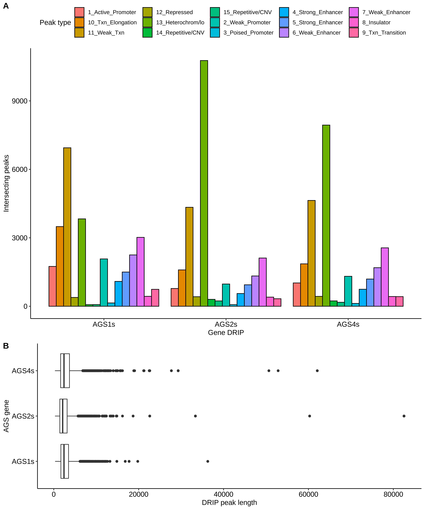

# DRIP-AGS-ENCODE

After reading the AGS paper (*Lim et al*) and thinking about SSB induced by
TOP1 in AGS cell lines and the fact that AGS2s (RNase H2) DRIP peaks were
falling in intergenic regions I thought it might be interesting to check
what proportion are falling in enhancers. The logic being that transcription of
eRNAs in the presence of SSB induced by lack of RNAse H1 could lead to
increased R-loop concentrations. 

Looks like when they said inter-genic they meant it.

I would like to look at GRO-seq data and map reads from (*Lim et al*) at some
point to see if there is overlapping reads in inter-genic regions.

However the resolution of the DRIP data is low.